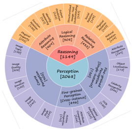

# MLLM Benchmark整理
[toc]
## 一、常用Benchmark
### 1. LLaVA-Bench (In-the-Wild)
- 来源：``Visual Instruction Tuning`` (LLaVa; NeurIPS23; University of Wisconsin–Madison, Microsoft Research, Columbia University)
- 评测目标：模型在复杂任务上的能力和新领域上的泛用性
- 评测任务：对话、描述、推理
- 数据来源：COCO
- 标注：图像描述
- 输入：question, image
- 输出：answer
- 评测：调用GPT-4，对比text-only GPT-4结果对answer打分
- 示例

- leaderboard: ShareGPT4V, LLaVa, InsturctBLIP

### 2. ScienceQA
- 来源：``Multimodal reasoning via thought chains for science question answering`` (NeruIPS22; University of California Arizona State University, Allen Institute for AI)
- 评测目标：在丰富领域上的推理思维链
- 数据来源：IXL Learning在线教育平台
- 标注：推理所需用到的知识，解释
- 输入：multi-choice question, image
- 输出：choice, explanation
- 评测：accuracy, 解释分数(BLEU-1/4, ROUGE-L, Similarity)
- 示例

- leaderboard: LLaVa, CoT相关, ChatGPT, SAM（得分较低，排名54）

### 3. MME
- 来源：``MME: A Comprehensive Evaluation Benchmark for Multimodal Large Language Models`` (Tencent Youtu Lab, Xiamen University)
- 评测目标：感知识别、认知推理能力
- 数据来源：COCO, CTW1500 (OCR), 自拍摄图像, diffusion生成
- 标注：人工标注的instruction-answer对
- 输入：instruction, image
- 输出：yes/no
- 评测：accuracy
- 示例

- leaderboard: Qwen-VL-Max, Gemini Pro, GPT-4V

### 4. MMBench
- 来源：``MMBench: Is Your Multi-modal Model an All-around Player?`` (Shanghai AI Laboratory, Nanyang Technological University, The Chinese University of Hong Kong, National University of Singapore, Zhejiang University)
- 评测目标：感知、推理等多层次能力

- 数据来源

- 标注：正确选项
- 输入：multi-choice question, image
- 输出：choice
- 评测：CircularEval, accuracy
- 示例

- leaderboard: GPT-4o, GPT-4v, InternVL-Chat, Qwen-VL-Max

### 5. MM-Vet
- 来源：``MM-Vet: Evaluating Large Multimodal Models for Integrated Capabilities`` (National University of Singapore, Microsoft Azure AI)
- 评测目标：recognition, knowledge, OCR, spatial awareness, language generation, math
- 数据来源：187 online sources, 10 XCR, 3 ChestX-ray14
- 标注：人工标注，互联网获取，已有数据集标注
- 输入：instruction, image
- 输出：answer
- 评测：GPT-4根据上下文例子打分

- 示例

- leaderboard: OpenFlagmingo, BLIP-2, LLaVa, MiniGPT, LLaMA-Adapter, InstructBLIP

### 6. SEED-Bench
- 来源：``A benchmark for evaluating Multimodal LLMs using multiple-choice questions`` (v2 CVPR2024; Tencent AI Lab 2ARC Lab, Tencent PCG)
- 评测目标

- 数据来源：CC3M, Something-Something-v2, Epic-kitchen 100, Breakfast
- 标注：提取视觉信息->生成问题答案对->人工筛选、标注
- 输入：multi-choice question, image/video
- 输出：choice
- 评测：将生成概率最高的选项作为模型答案，计算accuracy
- 示例

- leaderboard

### 7. POPE（重要）
- 来源：``Evaluating Object Hallucination in Large Vision-Language Models`` (EMNLP'23; Renmin University of China, Beijing Key Laboratory of Big Data Management and Analysis Methods)
- 评测目标：物体幻觉
- 数据来源：COCO (可按照{"image": "COCO_val2014_000000131089.jpg", "objects": ["person", "baseball bat"]}格式自建)
- 标注：物体GT
- 输入：question ("Is there a/an <object> in the image?"), image
- 输出：yes/no
- 评测：accuracy, precision, recall, F1 score
- 示例

- leaderboard: LLaVa, MiniGPT-4, InstructBLIP

### 8. RealWorldQA（可能重要）
- 来源：``HallusionBench: You See What You Think? Or You Think What You See? An Image-Context Reasoning Benchmark Challenging for GPT-4V(ision), LLaVA-1.5, and Other Multi-modality Models`` (xAI)
- 评测目标：真实世界空间理解
- 输入：question, image
- 输出：answer
- 评测：（%）
- 示例

- leaderboard: Grok-1.5V, GPT-4V, Gemini Pro

## 二、评测方法
[A Toolkit for Evaluating Large Vision-Language Models](https://github.com/open-compass/VLMEvalKit)
<table>
<thead>
<tr>
<th>Dataset</th>
<th>Dataset Names (for run.py)</th>
<th>Task</th>
<th>Dataset</th>
<th>Dataset Names (for run.py)</th>
<th>Task</th>
</tr>
</thead>
<tbody>
<tr>
<td><a href="https://github.com/open-compass/mmbench/"><strong>MMBench Series</strong></a>:  MMBench, MMBench-CN, CCBench</td>
<td>MMBench_DEV_[EN/CN] MMBench_TEST_[EN/CN] MMBench_DEV_[EN/CN]<em>V11 MMBench_TEST</em>[EN/CN]_V11 CCBench</td>
<td>Multi-choice  Question (MCQ)</td>
<td><a href="https://github.com/MMStar-Benchmark/MMStar"><strong>MMStar</strong></a></td>
<td>MMStar</td>
<td>MCQ</td>
</tr>
<tr>
<td><a href="https://github.com/BradyFU/Awesome-Multimodal-Large-Language-Models/tree/Evaluation"><strong>MME</strong></a></td>
<td>MME</td>
<td>Yes or No (Y/N)</td>
<td><a href="https://github.com/AILab-CVC/SEED-Bench"><strong>SEEDBench_IMG</strong></a></td>
<td>SEEDBench_IMG</td>
<td>MCQ</td>
</tr>
<tr>
<td><a href="https://github.com/yuweihao/MM-Vet"><strong>MM-Vet</strong></a></td>
<td>MMVet</td>
<td>VQA</td>
<td><a href="https://mmmu-benchmark.github.io" rel="nofollow"><strong>MMMU</strong></a></td>
<td>MMMU_DEV_VAL/MMMU_TEST</td>
<td>MCQ</td>
</tr>
<tr>
<td><a href="https://mathvista.github.io" rel="nofollow"><strong>MathVista</strong></a></td>
<td>MathVista_MINI</td>
<td>VQA</td>
<td><a href="https://scienceqa.github.io" rel="nofollow"><strong>ScienceQA_IMG</strong></a></td>
<td>ScienceQA_[VAL/TEST]</td>
<td>MCQ</td>
</tr>
<tr>
<td><a href="https://cocodataset.org" rel="nofollow"><strong>COCO Caption</strong></a></td>
<td>COCO_VAL</td>
<td>Caption</td>
<td><a href="https://github.com/tianyi-lab/HallusionBench"><strong>HallusionBench</strong></a></td>
<td>HallusionBench</td>
<td>Y/N</td>
</tr>
<tr>
<td><a href="https://ocr-vqa.github.io" rel="nofollow"><strong>OCRVQA</strong></a>*</td>
<td>OCRVQA_[TESTCORE/TEST]</td>
<td>VQA</td>
<td><a href="https://textvqa.org" rel="nofollow"><strong>TextVQA</strong></a>*</td>
<td>TextVQA_VAL</td>
<td>VQA</td>
</tr>
<tr>
<td><a href="https://github.com/vis-nlp/ChartQA"><strong>ChartQA</strong></a>*</td>
<td>ChartQA_TEST</td>
<td>VQA</td>
<td><a href="https://allenai.org/data/diagrams" rel="nofollow"><strong>AI2D</strong></a></td>
<td>AI2D_TEST</td>
<td>MCQ</td>
</tr>
<tr>
<td><a href="https://huggingface.co/datasets/liuhaotian/llava-bench-in-the-wild" rel="nofollow"><strong>LLaVABench</strong></a></td>
<td>LLaVABench</td>
<td>VQA</td>
<td><a href="https://www.docvqa.org" rel="nofollow"><strong>DocVQA</strong></a>+</td>
<td>DocVQA_[VAL/TEST]</td>
<td>VQA</td>
</tr>
<tr>
<td><a href="https://www.docvqa.org/datasets/infographicvqa" rel="nofollow"><strong>InfoVQA</strong></a>+</td>
<td>InfoVQA_[VAL/TEST]</td>
<td>VQA</td>
<td><a href="https://github.com/Yuliang-Liu/MultimodalOCR"><strong>OCRBench</strong></a></td>
<td>OCRBench</td>
<td>VQA</td>
</tr>
<tr>
<td><a href="https://x.ai/blog/grok-1.5v" rel="nofollow"><strong>RealWorldQA</strong></a></td>
<td>RealWorldQA</td>
<td>MCQ</td>
<td><a href="https://github.com/AoiDragon/POPE"><strong>POPE</strong></a>+</td>
<td>POPE</td>
<td>Y/N</td>
</tr>
<tr>
<td><a href="https://github.com/core-mm/core-mm"><strong>Core-MM</strong></a>-</td>
<td>CORE_MM</td>
<td>VQA</td>
<td></td>
<td></td>
<td></td>
</tr>
</tbody>
</table>