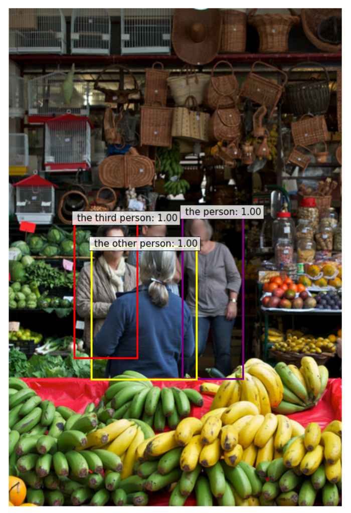

# MLLM Dataset整理
## 一、GoldG
### 1. 介绍
> GoldG, 0.8M human-annotated gold grounding data curated by MDETR, including Flickr30K, VG Caption, and GQA. We have removed COCO images from the dataset. It is designed to verify the effectiveness of gold grounding data.
### 2. GoldG VS GoldG+
GoldG从MDETR制作的数据集中剔除了COCO部分，GoldG+加回了COCO。
### 3. Dataset in MDETR
#### (1) 来源
#####  MS COCO
- Annotations from the referring expressions datasets (RefCOCO, RefCOCO+, RefCOCOg).
  - Each referring expression is a whole sentence that describes one object in the image, where the constituent noun phrases from the sentences are not themselves annotated. Perform text pre-processing using SpaCy to extract the ***root*** of the referring expression.
  - e.g. "***the person*** in the grey shirt with a watch on their wrist"
  - 
##### VG
- Annotations from VG regions.
  - Detect redundant sentences by normalizing them (removing all punctuation, stop-words, and lower-casing), then testing for quality. If there is a pair of equivalent sentences:
    - The corresponding boxes are highly overlapping (IoU > 0.7). Consider both annotations to be redundant, keep only one of them.
    - The boxes are non-overlapping. The most likely explanation is that the sentence is under-specified and actually corresponds to several distinct objects in the image. In this case, we merge the two data-points together, and the resulting annotations comports two boxes for this sentence.
  - Iterate recursively this process until no equivalent sentences remain.
- Questions from the GQA dataset
  - For key phrases in the questions, the bounding box annotations are provided.
#### (2) 格式
```json
{
    "info": {...},
    "licenses": {...},
    "images": [
        {
            "file_name": "COCO_train2014_000000581857.jpg",
            "height": 640,
            "width": 427,
            "id": 0,
            "original_id": "581857",
            "caption": "couple checking out the goods for sale at this shop. grey haired shop owner talking to customers. A woman wearing a gray shirt. A woman wearing a beige scarf. plantains displayed for sale on a table covered in red plastic. All types wicker baskets.",
            "tokens_negative": [
                [0, 6], [7, 15], [16, 19], [30, 33], [39, 41], [53, 57], [58, 64], [65, 69], [70, 75], [76, 83], [84, 86], [98, 99], [100, 105], [106, 113], [128, 129], [130, 135], [136, 143], [159, 168], [169, 178], [179, 182], [188, 190], [199, 206], [207, 209], [223, 226], [227, 232], [233, 239], [240, 247]
            ],
            "data_source": "coco",
            "dataset_name": "mixed"
        },
        ...,
        {
            "file_name": "2334951.jpg",
            "height": 500,
            "width": 375,
            "id": 1107630,
            "original_id": "2334951",
            "caption": "one man wearing pink tie.",
            "tokens_negative": [
                [0, 3],
                [4, 7],
                [8, 15]
            ],
            "data_source": "vg",
            "dataset_name": "mixed"
        }
    ],
    "annotations": [
        {
            "area": 18419.0,
            "iscrowd": 0,
            "image_id": 0,
            "category_id": 1,
            "id": 0,
            "bbox": [153.87387387387386, 258.56, 144.8978978978979, 208.64000000000001],
            "tokens_positive": [[0, 6]]
        },
        ...,
        {
            "area": 103790.0,
            "iscrowd": 0,
            "image_id": 1107630,
            "category_id": 1,
            "id": 6178785,
            "bbox": [33, 13, 214, 485],
            "tokens_positive": [[0, 3], [4, 7]]
        }
    ],
    "categories": []
}
```
1107631 images, 6178786 annotations
"sources" in ["coco", "vg"]
### 4. Flickr30k
Dataset in MDETR中并不包含Flickr30k，GoldG额外加入了Flickr30k。
```yaml
TRAIN: ("object365_dt_train", "mixed_train_no_coco", "flickr30k_train", )
# "object365_dt_train" -> O365
# "mixed_train_no_coco" + "flickr30k_train" -> GoldG
```